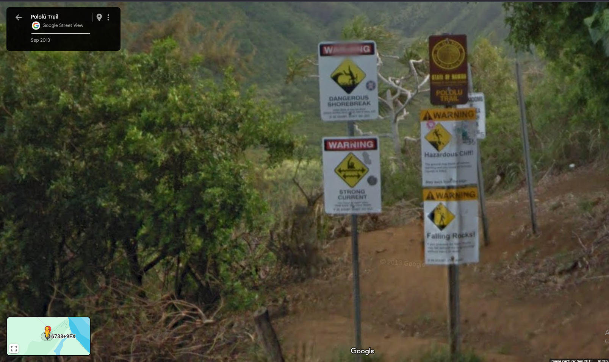

# /misc/Danger Searching - 286 points
This was a pretty simple OSINT/misc challenge, but is the most valuable one I've solved so far, for what it's worth.
# The Instructions:
> My friend told me that they hiked on a trail that had 4 warning signs at the trailhead: Hazardous cliff, falling rocks, flash flood, AND strong currents! Could you tell me where they went? They did hint that these signs were posted on a public hawaiian hiking trail.

> Note: the intended location has all 4 signs in the same spot. It is 4 permanent distinct signs - not 4 warnings on one sign or on a whiteboard.

> Note: Feel free to try multiple plus codes. The answer skews roughly one "plus code tile" south/west of where many people think it is.

> Flag is the full 10 digit [plus code](https://plus.codes/map) containing the signs they are mentioning, (e.g. lactf{85633HC3+9X} would be the flag for Bruin Bear Statue at UCLA). The plus code is in the URL when you select a location, or click the ^ at the bottom of the screen next to the short plus code to get the full length one. If your plus code contains 3 digits after the plus sign, zoom out and try selecting again.

**TL; DR:** There's a Hawaiian hiking trail with the following warning signs: Hazardous cliff, falling rocks, flash flood, strong currents. Find the corresponding plus code.

# Steps to solve:
As with any OSINT chall, the first step is to use a search engine. My query was "Hawaiian hiking trail 4 warning signs." 

That narrowed it down to two candidates: the Pololu Trail and the Kalalau Trail. I first looked for the Pololu Trailhead, and the resulting Google StreetView image was very promising: 

