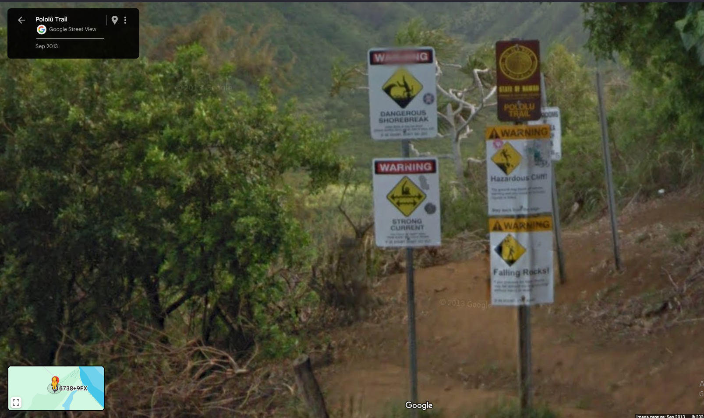
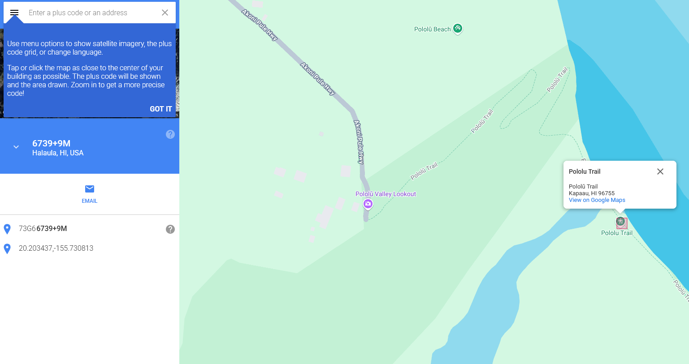
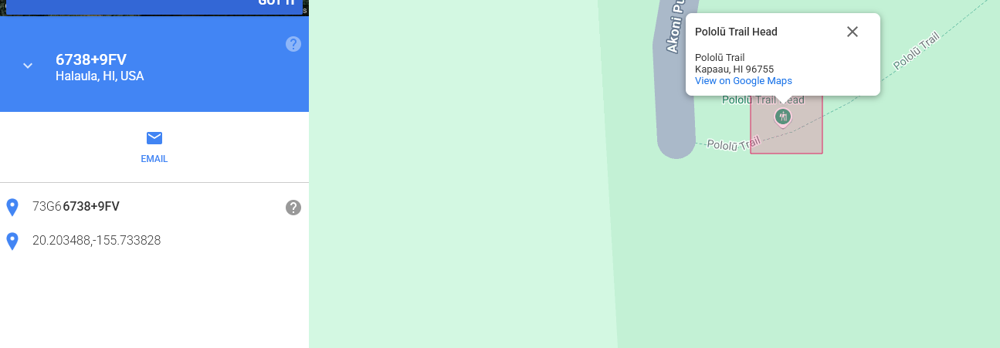
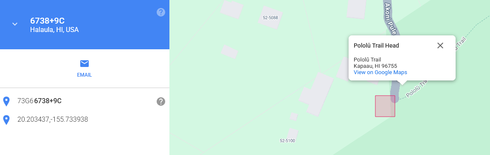

# /misc/Danger Searching - 286 points
This was a pretty simple OSINT/misc challenge, but was around 1/7 of the total points BK got for LActf :skull: (we were in Spokane for an in-person CTF, and I solved this crashed on the couch after having pizza, W evening.)
# The Instructions:
> My friend told me that they hiked on a trail that had 4 warning signs at the trailhead: Hazardous cliff, falling rocks, flash flood, AND strong currents! Could you tell me where they went? They did hint that these signs were posted on a public hawaiian hiking trail.

> Note: the intended location has all 4 signs in the same spot. It is 4 permanent distinct signs - not 4 warnings on one sign or on a whiteboard.

> Note: Feel free to try multiple plus codes. The answer skews roughly one "plus code tile" south/west of where many people think it is.

> Flag is the full 10 digit [plus code](https://plus.codes/map) containing the signs they are mentioning, (e.g. lactf{85633HC3+9X} would be the flag for Bruin Bear Statue at UCLA). The plus code is in the URL when you select a location, or click the ^ at the bottom of the screen next to the short plus code to get the full length one. If your plus code contains 3 digits after the plus sign, zoom out and try selecting again.

**TL; DR:** There's a Hawaiian hiking trail with the following warning signs: Hazardous cliff, falling rocks, flash flood, strong currents. Find the corresponding plus code.

# Steps to solve:
As with any OSINT chall, the first step is to use a search engine. My query was "Hawaiian hiking trail 4 warning signs." 

That narrowed it down to two candidates: the Pololu Trail and the Kalalau Trail. I first looked for the Pololu Trailhead, and the resulting Google StreetView image was very promising: 



So I went to the [provided plus codes website](https://plus.codes/map). then, I first tried entering a few codes from the POI on the map:



I realized that was stupid, because the signs should be on the trailhead. So I zoomed in to find the POI and there it was: 



But this was wrong too, so I heeded the instructions, zoomed out one step, and clicked to the southwest.



Here's the correct flag: 

```lactf{73G66738+9C}```

So yeah, nothing too involved for an OSINT, no need to break out the Bellingcat OSM search or anything, just plain old Googling did the trick. Got lucky being right on the first guess, though.

Small note being that the Google trekker coverage from 2013 has one differing sign from the instructions, which threw me off at first.

**Thanks for reading!**